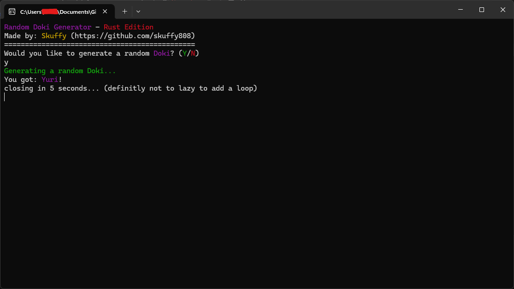

# Random Doki Generator - Rust Edition

A simple Random Doki Generator originally created by [Nate](https://github.com/narchive-nz/) in another python, now ported to Rust.  

This was one of my first Rust projects, so please go easy on me 😅.

---

## Rust Crates Used

- `colored = "2"` – for colorful terminal output  
- `rand = "0.8"` – for random number generation  

---

## Screenshots

  
*Example output showing Yuri being randomly selected by the generator, with colorful terminal text.*

## License

This project is licensed under the MIT License. See the [LICENSE](LICENSE) file for details.
